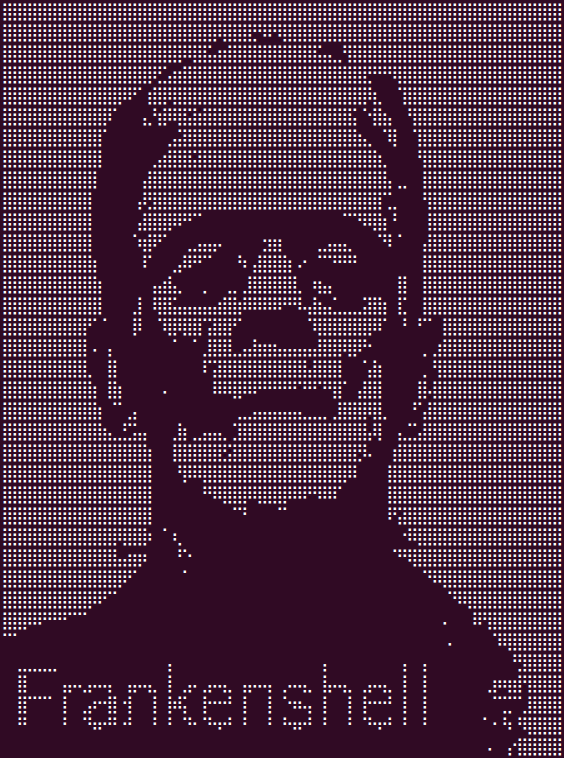

<!-- ahokcool HEADER START-->
---
<a id="top"></a>
<div align="center">
  <a href="https://github.com/ahokcool/ahokcool/blob/main/README.md">
    
  </a><br>
  An overview of all my projects can be found here: <a href="https://github.com/ahokcool/ahokcool/blob/main/README.md" target="_blank">ahokcool</a><br><br>
  <a href="https://www.42lisboa.com">
    
  </a><br>
  This project was created as part of my studies at: <a href="https://www.42lisboa.com" target="_blank">42 Lisboa</a><br>
</div>

---
<!-- ahokcool HEADER END-->
<!-- PROJECT HEADER START -->
<br />
<div align="center">
  <a href="./">
    
  </a>
  <h1 align="center">fdf</h1>
<p align="center">
    The idea of the fdf project, French "fil de fer" for "wireframe model", is to visualise wireframe models. This is done by reading a map with 3-D coordinates from a file and storing it in a linked list. These 3D coordinates are then transformed into 2D coordinates according to the user's preferences and displayed in a window.
</p>
</div>
<br>
<!-- PROJECT HEADER END -->

## :bulb: Lessons learned
- working with the API of [a graphics library](https://github.com/42Paris/minilibx-linux)
- understanding points in 2 and 3 dimensional space, vectors and trigonometric functions
- [Bresenham's line algorithm](https://en.wikipedia.org/wiki/Bresenham%27s_line_algorithm)
- Using a [rotation matrix](https://en.wikipedia.org/wiki/Rotation_matrix) to transform coordinates

## Installation
```
$ git clone --recurse-submodules https://github.com/ahokcool/fdf.git    # Clone
$ cd fdf                                                                # Change directory
$ make                                                                  # Compile
$ ./fdf map_file                                                        # Run
```


<!-- Improved compatibility of back to top link: See: https://github.com/othneildrew/Best-README-Template/pull/73 -->
<a id="readme-top"></a>

<!-- PROJECT LOGO -->
<br />
<div align="center">
  <a href="./">
    
  </a>
  <h1 align="center">frankenshell</h1>
<p align="center">
    frankenshell is a version of the 42 School project minishell that recreates a simplified version of the bash shell written in C
    <br />
    <a href="./docs/documentation.md"><strong>Explore the docs »</strong></a>
</p>
</div>
<br>

<!-- TABLE OF CONTENTS -->
## Table of Contents
<b>
  <ol>
    <li><a href="#about-the-project">About The Project</a></li>
    <li><a href="#installation">Installation</a></li>
    <li><a href="#usage">Usage</a></li>
    <li><a href="#acknowledgments">Acknowledgments</a></li>
  </ol>
</b>
<br>

<!-- ABOUT THE PROJECT -->
## About The Project

As ChatGPT said in 2023:

> Minishell is a [42 school][url-42] project that aims to create a simplified Unix shell using [bash][url-bash] as a reference. The idea behind Minishell is to develop a basic command-line interface (CLI) that can execute simple commands and handle input/output redirection. It's meant to serve as a learning exercise for students to gain a fundamental understanding of how shells work by implementing core features like parsing user input, managing processes, handling signals, creating builtins and executing system commands.


<!-- INSTALLATION -->
## Installation
```
$ git clone https://github.com/ahokcool/frankenshell.git  # Clone
$ cd frankenshell                                         # Change directory
$ make                                                    # Compile
$ ./frankenshell [OPTIONS]                                # Run (Option: --info)
$ echo "Let's goooooo!"                                   # Use
	Let's goooooo!
$ exit                                                    # Exit
```

<!-- USAGE EXAMPLES -->
## Usage

**frankenshell** is designed to mimic the behavior of the traditional [:link: **bash shell**][url-bash]. So feel free to use it like bash.

[![Example][example-gif]][link-docs]

<!-- ACKNOWLEDGMENTS -->
## Acknowledgments
Thx to all those guys and gals for hints, tipps and feedback!

[@Gabriel](https://github.com/portugueseTorch)\
[@Martim](https://github.com/mm1212)\
[@Margarida](https://github.com/MariaAguiar)\
[@Manuel](https://github.com/manuel-aguiar)

---

<a href="./docs/documentation.md"><strong>»»» Explore the Documentation!</strong></a>

---

<!-- MARKDOWN LINKS & IMAGES -->
[example-gif]: /images/example.gif
[link-docs]: ./docs/documentation.md
[url-bash]: https://de.wikipedia.org/wiki/Bash_(Shell)
[url-42]: https://42.fr/en/homepage/

<!-- ahokcool FOOTER-->
---
<p align="center">
  <a href="#top">🔝 back to top 🔝</a>
</p>
